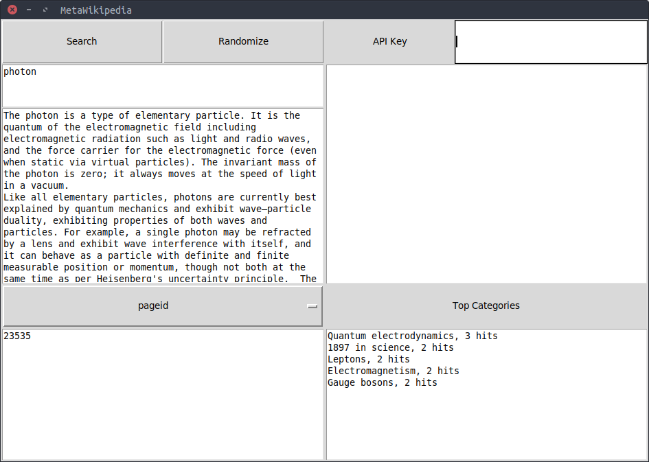

# MetaWikipedia
MetaWikipedia is a simple gui environment for exploring the connections 
between wikipedia pages and related news articles. 

## Libraries
This was a simple project to learn `tkinter`. 
`NewsApiClient` is also used and requires a News API key.
The python `wikipedia` library is also required.

## Running
`python main.py`
